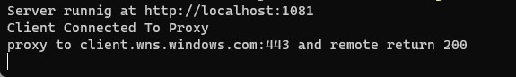
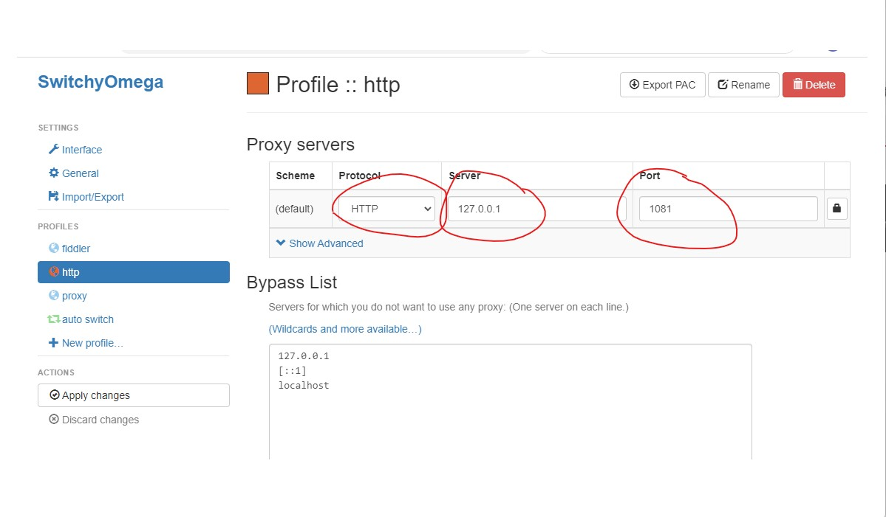
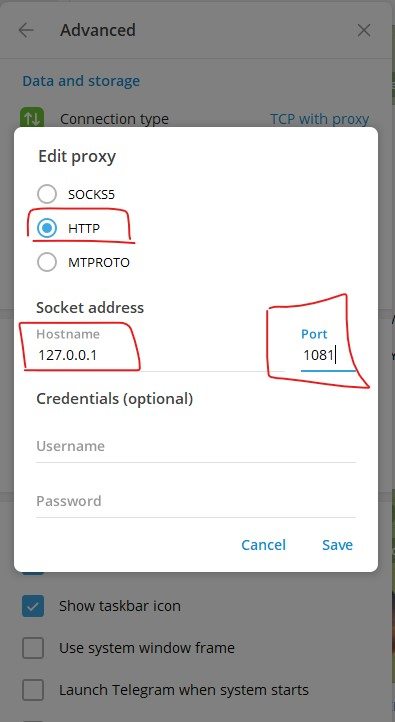

# Edge Tunnel （正在开发）

**v2ray-heroku 由于 heroku 取消免费，项目已经死了。 这是新的项目。**

> 项目正在开发，基本可用，会有 bug。。

一个无比简单安全，基于 edge 的 tunnel 。

## Edge Tunnel server --- Deno deploy

Edge tunnel 的服务使用了 [Deno deploy](https://deno.com/deploy).

> 这里十分感谢 Deno deploy 严肃对待 web standard， 支持 HTTP request & response streaming，让 edge tunnel 成为可能。

> 这里没有使用 deno websocket，其实技术上可以把 v2ray 移植过来。但是我暂时没有看明白 VLESS 协议内容.

### 如何部署服务

请查看下面教程。

[Deno deploy Install](./doc/edge-tunnel-deno.md)

## Edge Tunnel 客户端

> 由于看不懂 VLESS 协议内容, 所以无法使用常用的客户端软件.

### 安装

请转到本项目 [releases](https://github.com/zizifn/edgetunnel/releases),选择正确的平台，下载最新客户端.

项目使用https://github.com/vercel/pkg, 所以支持下面平台.

1. **platform** alpine, linux, linuxstatic, win, macos, (freebsd)
2. **arch** x64, arm64, (armv6, armv7)

## 启动

解压并且修改安装文件的 `config.json` 文件.

```json
{
  "port": "1081", // 本地 HTTP 代理的端口
  "address": "https://****.deno.dev/", // deno deploy URL
  "uuid": "****" // 你 deno deploy 设置的用户
}
```

然后,在解压目录下，打开命令行, 输入下面命令.

> Edge Tunnel Client 会在本地启动一个 http 代理.

> 如果系统提示，是否允许网络权限，请允许。

```ps
.\edgetunnel-win-x64.exe run --config .\config.json
```



> 请不要关闭关闭命令行. 如果关闭,代理会自动退出.

### 验证代理是否正常

再次开启一个新的命令行，测试 proxy 是否启动正常。。**注意自己 proxy 的端口**。

```bash
curl -v https://www.google.com --proxy http://127.0.0.1:1081
```

如果有返回结果，并且 edge tunnel 命令行有提示，说明一切成功。

```
proxy to www.google.com:443 and remote return 200
```

## 浏览器 switchyomega 设置

具体安装和配置,请查看官网.
https://proxy-switchyomega.com/settings/

除了端口（port）和下图可能不一样。其他都应该是一样的。

> 端口是你在 config.json 自己配置的



## 系统全局 proxy 配置

你也可以配置 proxy 到系统级别。

## 其他软件 proxy 设置

下面以电报为例，其他软件也是一样的。具体方式请用搜索引擎。

路径， setting--> Advance-->Conntction type--> Use Custom proxy

