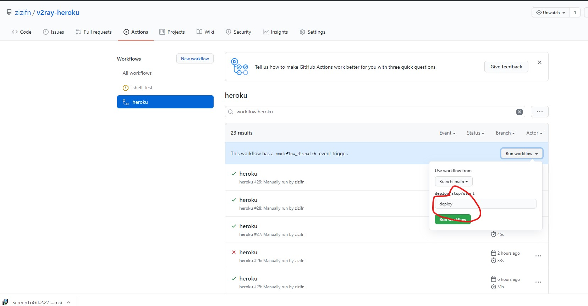

# v2ray-heroku

> ~~貌似新建的app有些需要科学访问~~，如果需要，请使用cloudflare worker CDN 套一层。

> 切换到最新的 VLESS 协议。具体客户端配置请看 config 章节。

> v2ray-heroku 是我的主力 backup，我会日常维护它。加入或者修改一些我认为好的配置。但这一般会导致客户端配置需要些许修改。 不过具体配置都会体现在 [详细 VLESS websocket 客户端配置](#vless-websocket-客户端配置)

首先查看别人的 [youtube 教程](https://www.youtube.com/watch?v=xHZyDsFYdvA)，了解怎么配置 v2ray-heroku。**本项目使用最新 VLESS 协议，请在客户端配置选择 VLESS**。  
[详细 VLESS websocket 客户端配置](#vless-websocket-客户端配置) 。

如果你还想自动化你的 heroku，请查看下面的教程。

本项目是包含，

- 一键部署 V2ray 到 heroku。
- 利用 Github action 实现 重新部署/停止/启动。
- **支持多app和多账户 重新部署/停止/启动。**
- 利用 cloudflare CDN 进行加速。

```text
项目Dockerfile是基于V2fly 官方镜像制作。仅仅增加生产配置文件的脚本。重新部署就可以更新到最新的v2ray。
基于官方镜像，这也是v2fly 推荐的做法。
```

> 保持安全最简单的方式就是，保持软件更新。

## 一键部署

[](https://heroku.com/deploy)

## Github Actions 管理

请 Fork 本项目到自己的账户下。 Actions 需要以下 Secrets 才能正常工作，这些 Secrets 会被 workflow 中的 [akhileshns/heroku-deploy](https://github.com/AkhileshNS/heroku-deploy) 使用。

具体实现细节，请查看 [workflow 配置文件](./.github/workflows/main.yml).

| Name              | Description                                |
| ----------------- | ------------------------------------------ |
| APP_NAME          | 就是你 heroku 项目的名字                   |
| EMAIL             | heroku 账户的 email                        |
| HEROKU_API_KEY    | heroku API key， 在 account 设置下可以找到 |
| HEROKU_V2RAY_UUID | V2rayUUID                                  |

> 请务必生成新的 UUID。使用已有的 UUID 会使自己 V2ray 暴露在危险之下。

PowerShell:

```powershell
PS C:\Users\> New-Guid
```

Shell:

```bash
xxx@xxx:/mnt/c/Users/$ uuidgen
```

### Github Secrets

路径

```text
项目Setting-->Secrets
```


### Heroku API key

路径

```text
heroku Account settings-->API key
```


### Github Actions 界面

```text
Actions
```


### 重新部署

点击 `Run workflow`, 输入 deploy。 然后就会重新 deploy。



### 停止

点击 `Run workflow`, 输入 stop。 然后就会 stop，不在计入小时数。


### 启动

点击 `Run workflow`, 输入 start。 然后就会启动。


## 建立 cloudflare worker （可选）

如果遇到创建的app在正常网络下不能访问，请尝试这个。

可以参考 开头的视频。代码如下。

```javascript
addEventListener("fetch", (event) => {
  let url = new URL(event.request.url);
  url.hostname = "你的heroku的hostname";
  let request = new Request(url, event.request);
  event.respondWith(fetch(request));
});
```

为 worker 选择速度更快的 IP。
https://github.com/badafans/better-cloudflare-ip

## 使用 Environments 实现 多账户/多app Secrets 管理

文档介绍： https://docs.github.com/en/actions/deployment/using-environments-for-deployment

### 建立 Environments, 并添加 Secrets

1. 创建 Environments

2. 添加 Secrets


### 输入环境名字
**一定要确保环境名字是对的，要不然就会用主的Secrets。**


## VLESS websocket 客户端配置

### JSON

```json
"outbounds": [
        {
            "protocol": "vless",
            "settings": {
                "vnext": [
                    {
                        "address": "***.herokuapp.com", // heroku app URL 或者 cloudflare worker url/ip
                        "port": 443,
                        "users": [
                            {
                                "id": "", // 填写你的 UUID
                                "encryption": "none"
                            }
                        ]
                    }
                ]
            },
            "streamSettings": {
                "network": "ws",
                "security": "tls",
                "tlsSettings": {
                    "serverName": "***.herokuapp.com" // heroku app host 或者 cloudflare worker host
                }
              }
          }
    ]
```

### v2rayN

换成 [V2rayN](https://github.com/2dust/v2rayN)

别人的配置教程参考，https://v2raytech.com/v2rayn-config-tutorial/.


