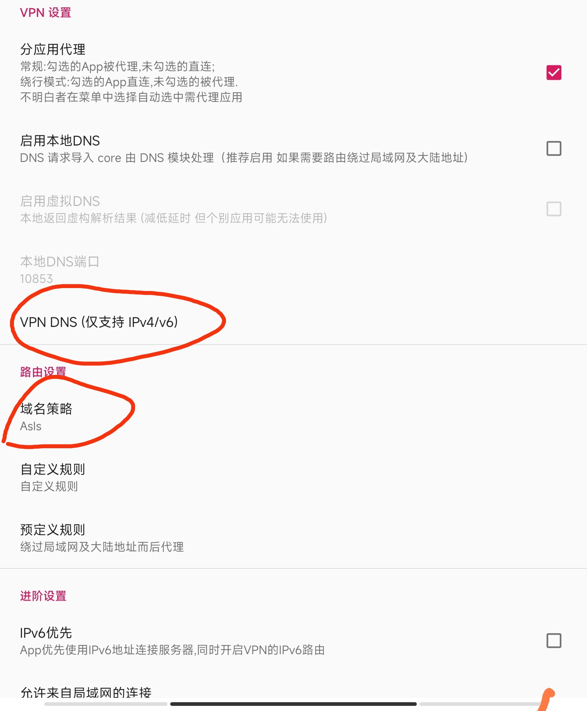

# V2ray Edge（Beta）

众所周知，V2ray 是基于 `go` 的，导致原版 V2ray 无法部署到基于 `javaScript (V8)` 的平台上。

本项目通过，使用 `js` 实现 `VLESS`协议， 使得 **V2ray** 可以部署到一些 Edge 或者 Serverless 平台上。

> For international user, I write this readme in Chinese. But I understand English pretty well, if you has any issue, please open it in Github.

> 项目正在完善阶段，欢迎大家使用，如果发现 bug， 请开 issue。
> **请定期按照 github 的提示，同步最新代码。只需要在乎下图红框的提示，其他提示不要点击**。
> 如果你喜欢自动化，可以使用这个自动同步 fork https://github.com/apps/pull > 

> 同步完成后，如果发现不一样，**请看文档**。

> 本项目纯属技术性验证，探索最新的 web standard。请勿乱用，不给予任何保证。

## V2ray Edge server --- Deno deploy

Edge tunnel 的服务使用了 [Deno deploy](https://deno.com/deploy).

### 风险提示

`Deno deploy` 采用 [fair use policy](https://deno.com/deploy/docs/fair-use-policy), 翻译成中文就是`看良心使用`。 违反可能会封号。
按照我的理解，本项目应该是违反 fair use policy。请大家**酌情使用**。

### 如何部署服务

请查看下面教程。

[Deno deploy Install](./doc/edge-tunnel-deno.md)

## V2ray Edge server --- Cloudflare Worker （敬请期待）

这个需要等 Cloudflare 发布下面的技术。
https://blog.cloudflare.com/introducing-socket-workers/

> Cloudflare 大气的免费政策，外加 优选 IP。使得 部署 V2ray 变得无比简单。

> 这个不是利用 Worker 进行反代， 而是直接部署 V2ray （js 版本）到 Worker 上。

## V2ray Edge server --- Node.js

很多 Node.js 的平台都是支持 docker 的，所以可以直接部署原版。但是既然很多人要，我就写一个。我目前仅仅维护 render 平台的文档。理论上其他平台都一样。

### render.com

[render](./doc/render.md)

## 客户端 v2rayN 配置

> ⚠️ 由于 edge 平台限制，无法转发 UDP 包。请在配置时候，把 DNS 的策略改成 "Asis", 否则会影响速度。
> 请不要开启 ipv6 优先。

> [ DNS 科普文章](https://tachyondevel.medium.com/%E6%BC%AB%E8%B0%88%E5%90%84%E7%A7%8D%E9%BB%91%E7%A7%91%E6%8A%80%E5%BC%8F-dns-%E6%8A%80%E6%9C%AF%E5%9C%A8%E4%BB%A3%E7%90%86%E7%8E%AF%E5%A2%83%E4%B8%AD%E7%9A%84%E5%BA%94%E7%94%A8-62c50e58cbd0)

### Windows 版本

https://github.com/2dust/v2rayN
别人的配置教程参考，https://v2raytech.com/v2rayn-config-tutorial/.

具体配置，请参考部署服务的主页。

### 安卓

[v2rayNG](https://github.com/2dust/v2rayNG)

[SagerNet](https://github.com/SagerNet/SagerNet)

如果遇到安卓无法使用, 请参考如下配置，多尝试下 DNS 设置。

v2rayNG 设置。


### IOS

> 需要美国区账户

[shadowrocket](https://apps.apple.com/us/app/shadowrocket/id932747118)

## 建立 cloudflare worker 反代 （可选）

```js
const targetHost = 'xxx.xxxx.dev'; //你的 edge function 的hostname
addEventListener('fetch', (event) => {
  let url = new URL(event.request.url);
  url.hostname = targetHost;
  let request = new Request(url, event.request);
  event.respondWith(fetch(request));
});
```

优选 IP https://github.com/XIU2/CloudflareSpeedTest

# FAQ

## 那些平台可以使用？

判断一个平台是否可以支持的，有 2 个必要条件，

1. 是否支持 websocket？
   - 或者支持，HTTP request stream 也是可以的。https://developer.chrome.com/articles/fetch-streaming-requests/
2. 可以创建 raw tcp socket？

> Cloudflare Worker 虽然支持 websocket，但是 Worker 的 runtime 没有支持 创建 raw tcp socket 的 API。

## 不支持 UDP

由于 edge 平台限制，无法转发 UDP 包。所以 DNS 策略请设置成 `Asis`.

## 不支持 VMESS

VMESS 协议过于复杂，并且所有 edge 平台都支持 HTTPS， 所以无需 VMESS.

# 反馈与交流

如果有问题，请使用 https://t.me/edgetunnel 进行交流。
