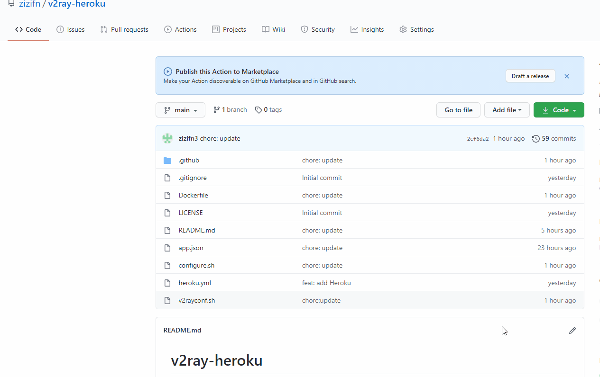
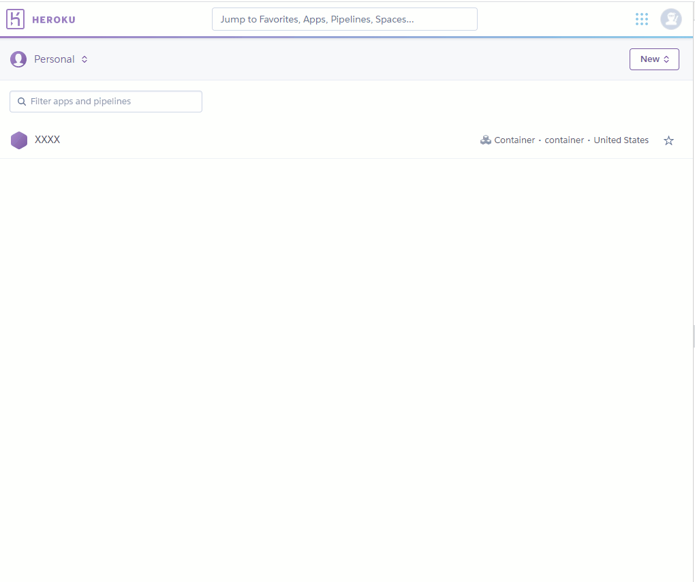
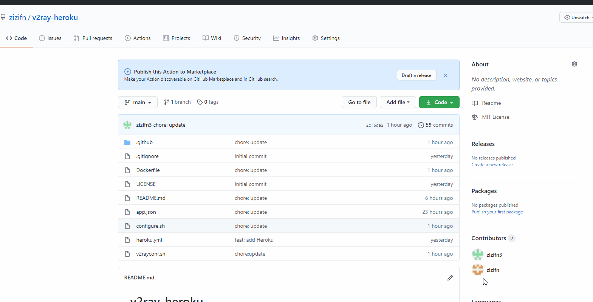
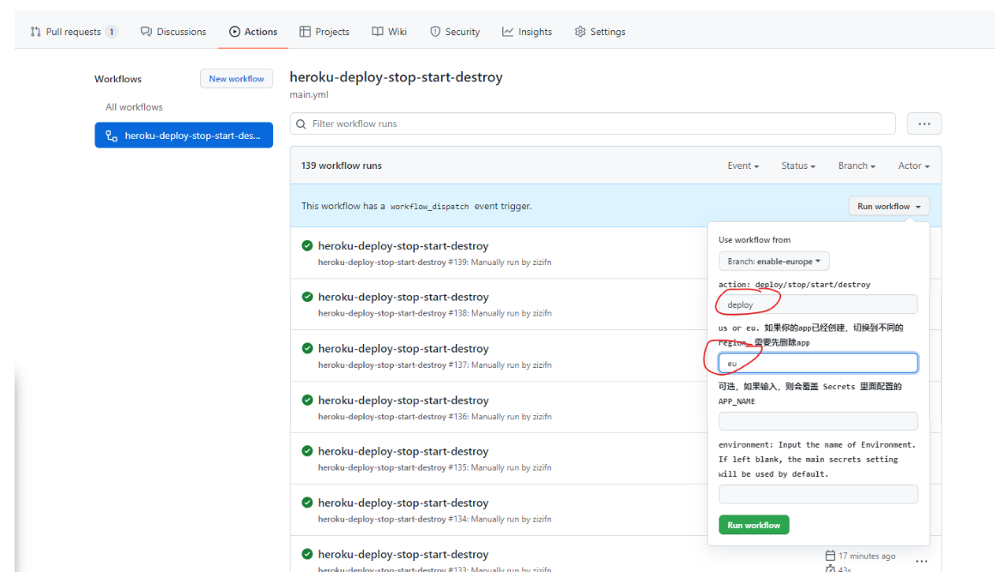
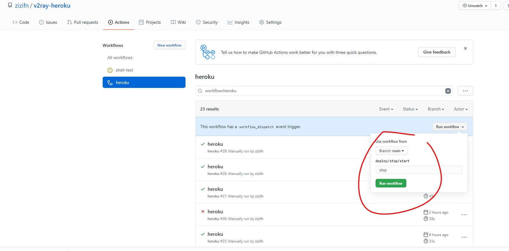
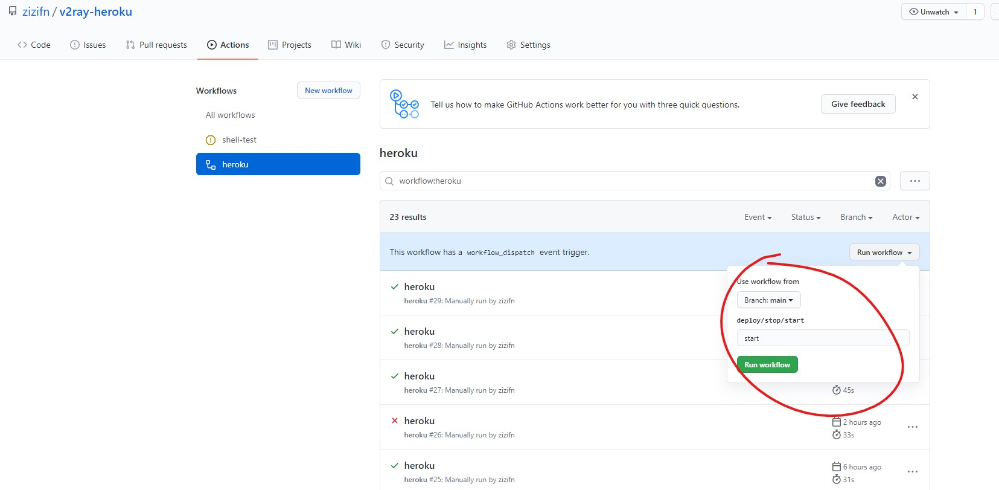
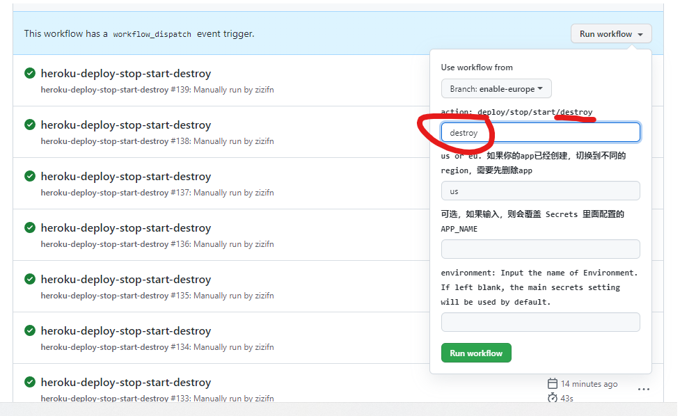
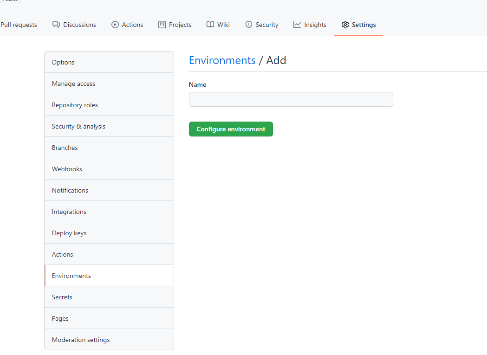
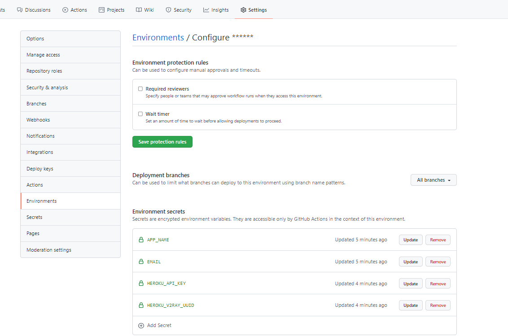
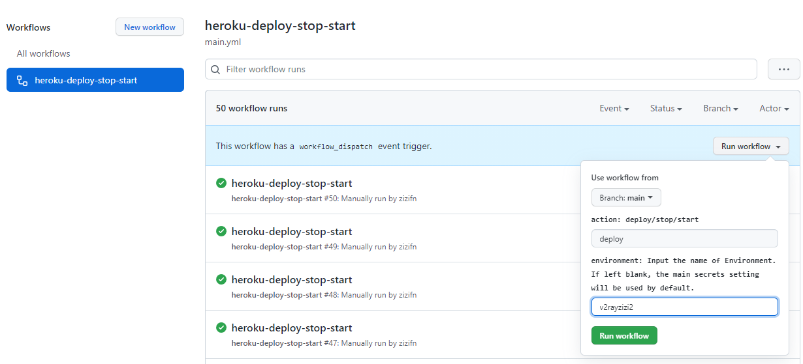

# v2ray-heroku

> ~~貌似新建的app有些需要科学访问~~，如果需要，请使用cloudflare worker CDN 或者 cloudflare tunnel 套一层。

> 切换到最新的 VLESS 协议。具体客户端配置请看 config 章节。

> v2ray-heroku 是我为了体验 github action 的产物，也是我的主力 backup，我会日常维护它。加入或者修改一些我认为好的配置。但这一般会导致客户端配置需要些许修改。 不过具体配置都会体现在 [详细 VLESS websocket 客户端配置](#vless-websocket-客户端配置)

> 有问题请开 issue 或者 discussions。

> 很多人反馈 heroku 封号，我自己的还好用，请大家反馈，如果大部分人都被封号，我就准备开个新坑，反正免费服务也有其他家。。只是我懒，同时维护多个实在没有时间。

## **请大家不要跑速度测试，请用 youtube 测试。**


## Change log

应需求，加上首页伪装，每次部署都会随机生成首页，如果你有想法，请自己把想要的html放入到 项目html 文件，然后后续 action 部署会自动拿到。

## !!!!!!! **对于一些老用户是 breaking change, 对 ws 的 path 做了修改, 请注意查看客户端配置**


首先查看别人的 [youtube 教程](https://www.youtube.com/watch?v=xHZyDsFYdvA)，了解怎么配置 v2ray-heroku。**本项目使用最新 VLESS 协议，请在客户端配置选择 VLESS**。  
[详细 VLESS websocket 客户端配置](#vless-websocket-客户端配置) 。

如果你还想自动化你的 heroku，请查看下面的教程。

本项目是包含，

- 一键部署 V2ray 到 heroku。
- 利用 Github action 实现 [重新部署](#重新部署)/[停止](#停止)/[启动](#启动)/[删除](#删除)。
- 支持 heroku 的区域（us 和 eu）
- **支持[多app和多账户](#使用-environments-实现-多账户多app-secrets-管理) [重新部署](#重新部署)/[停止](#停止)/[启动](#启动)/[删除](#删除)。**

- 利用 cloudflare CDN 进行加速。
- **利用 [cloudflare tunnel](https://www.cloudflare.com/products/tunnel/) 进行加速。**
- **随机生成首页。每次部署都会产生随机首页。**
    1. 如想自定义主页，请自行在仓库中生成 index.html 放入 `html` 中

```text
项目Dockerfile是基于V2fly 官方镜像制作。仅仅增加生产配置文件的脚本。重新部署就可以更新到最新的v2ray。
基于官方镜像，这也是v2fly 推荐的做法。
```

> 保持安全最简单的方式就是，保持软件更新。

## 一键部署

[](https://heroku.com/deploy)

> 貌似在这个 repo 下 点击 一键部署貌似 heroku 提示违反某些原则，但是action 正常工作！！建议 fork 时候，项目名字，尽量不要带有 v2ray 关键字。

> 如果被heroku 提示错误，请用 github action 来部署。

> 部署成功后，可以先用浏览器访问 ***.herokuapp.com， 查看页面是否能正常访问。会显示一个随机的维基百科页面。

## Github Actions 管理

请 Fork 本项目到自己的账户下。 Actions 需要以下 Secrets 才能正常工作，这些 Secrets 会被 workflow 中的 [akhileshns/heroku-deploy](https://github.com/AkhileshNS/heroku-deploy) 使用。

具体实现细节，请查看 [workflow 配置文件](./.github/workflows/main.yml). 如何配置， 请查看，[Github Secrets](#github-secrets)

| Name              | Description                                |
| ----------------- | ------------------------------------------ |
| APP_NAME          | 就是你 heroku 项目的名字. 如果你是第一次创建APP，**请确保名字是唯一的**|
| EMAIL             | heroku 账户的 email                      |
| HEROKU_API_KEY    | heroku API key，在 account 设置下可以找到 |
| HEROKU_V2RAY_UUID | V2rayUUID                                |
| HEROKU_TUNNEL_TOKEN | **可选** cloudflare tunnel 的 token    |

> 这样Token一定必须是大写。。请在 heroku 网站创建app，来确保项目的名字的唯一性。

HEROKU_TUNNEL_TOKEN 是可选项，可以忽略. 详细说明，请查看章节 《建立-cloudflare-tunnel-（可选）》

> 请务必生成新的 UUID。使用已有的 UUID 会使自己 V2ray 暴露在危险之下。


PowerShell:

```powershell
PS C:\Users\> New-Guid
```

Shell:

```bash
xxx@xxx:/mnt/c/Users/$ uuidgen
```

### Github Secrets

路径

```text
项目Setting-->Secrets
```



### Heroku API key

路径

```text
heroku Account settings-->API key
```



### Github Actions 界面

```text
Actions
```



### 重新部署

点击 `Run workflow`, 输入 deploy。 然后就会重新 deploy。

这里可以**选择区域**，但是请确保app没有被创建过。如果要切换区域，请先使用 destroy 删除应用。



### 停止

点击 `Run workflow`, 输入 stop。 然后就会 stop，不在计入小时数。


### 启动

点击 `Run workflow`, 输入 start。 然后就会启动。



### 删除

点击 `Run workflow`, 输入 destroy  然后就会删除。




## 建立 cloudflare worker （可选）

如果遇到创建的app在正常网络下不能访问，请尝试这个。

可以参考 开头的视频。代码如下。

```javascript
addEventListener("fetch", (event) => {
  let url = new URL(event.request.url);
  url.hostname = "你的heroku的hostname";
  let request = new Request(url, event.request);
  event.respondWith(fetch(request));
});
```

如果 worker 不好用，请用自己域名代理 worker
https://owo.misaka.rest/cf-workers-ban-solution/

为 worker 选择速度更快的 IP。
https://github.com/badafans/better-cloudflare-ip

## 建立 cloudflare tunnel （可选）

项目集成 cloudflare tunnel， 在配置 Secrets `HEROKU_TUNNEL_TOKEN` 之后生效。具体怎么配置，请查看 [cloudflare tunnel](./cloudflared-tunnel.md)。

## 使用 Environments 实现 多账户/多app Secrets 管理

文档介绍： https://docs.github.com/en/actions/deployment/using-environments-for-deployment

### 建立 Environments, 并添加 Secrets

1. 创建 Environments

2. 添加 Secrets


### 输入环境名字
**一定要确保环境名字是对的，要不然就会用主的Secrets。**


## VLESS websocket 客户端配置

### JSON

```json
"outbounds": [
        {
            "protocol": "vless",
            "settings": {
                "vnext": [
                    {
                        "address": "***.herokuapp.com", // heroku app URL 或者 cloudflare worker url/ip
                        "port": 443,
                        "users": [
                            {
                                "id": "", // 填写你的 UUID
                                "encryption": "none"
                            }
                        ]
                    }
                ]
            },
            "streamSettings": {
                "network": "ws",
                "security": "tls",
                "tlsSettings": {
                    "serverName": "***.herokuapp.com" // heroku app host 或者 cloudflare worker host
                }
              }
          }
    ]
```

### v2rayN


换成 [V2rayN](https://github.com/2dust/v2rayN)

别人的配置教程参考，https://v2raytech.com/v2rayn-config-tutorial/.


cloudflare worker ip 配置


