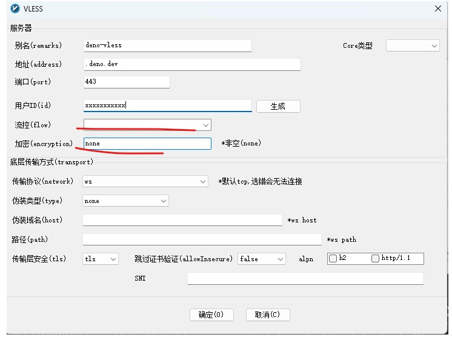

# Edge Tunnel （Beta）

把 **V2ray** 部署到 Edge/Serverless Functions 平台上。

**v2ray-heroku 由于 heroku 取消免费，项目已经死了。这里是新的项目。**

> 项目正在开发，基本可用，会有 bug。。
> **请定期按照 github 的提示，只同步到自己的项目。只需要在乎下图红框的提示，其他提示不要点击**。
> 

> 本项目纯属技术性验证，探索最新的 web standard。不给予任何保证。

## Edge Tunnel server --- Deno deploy

Edge tunnel 的服务使用了 [Deno deploy](https://deno.com/deploy).

### 风险提示

`Deno deploy` 采用 [fair use policy](https://deno.com/deploy/docs/fair-use-policy), 翻译成中文就是`看良心使用`。 违反可能会封号。
按照我的理解，本项目应该是违反 fair use policy。请大家**酌情使用**。

> 这里十分感谢 Deno deploy 严肃对待 web standard， 支持 HTTP request & response streaming，让 edge tunnel 成为可能。

### 如何部署服务

请查看下面教程。

[Deno deploy Install](./doc/edge-tunnel-deno.md)

## Edge Tunnel server --- Cloudflare Worker （敬请期待）

这个需要等 Cloudflare 发布下面的技术。
https://blog.cloudflare.com/introducing-socket-workers/

## 客户端 v2rayN 配置

> ⚠️ 由于 edge 平台限制，无法转发 UDP 包。请在配置时候，把 DNS 的策略改成 "Asis", 否则会影响速度。

> [ DNS 科普文章](https://tachyondevel.medium.com/%E6%BC%AB%E8%B0%88%E5%90%84%E7%A7%8D%E9%BB%91%E7%A7%91%E6%8A%80%E5%BC%8F-dns-%E6%8A%80%E6%9C%AF%E5%9C%A8%E4%BB%A3%E7%90%86%E7%8E%AF%E5%A2%83%E4%B8%AD%E7%9A%84%E5%BA%94%E7%94%A8-62c50e58cbd0)

https://github.com/2dust/v2rayN
别人的配置教程参考，https://v2raytech.com/v2rayn-config-tutorial/.


## VLESS websocket 客户端配置

> ⚠️ 由于 edge 平台限制，无法转发 UDP 包。请在配置时候，把 DNS 的策略改成 "Asis", 否则会影响速度。

```json
"outbounds": [
        {
            "protocol": "vless",
            "settings": {
                "vnext": [
                    {
                        "address": "***.herokuapp.com", // edge app URL 或者 cloudflare worker url/ip
                        "port": 443,
                        "users": [
                            {
                                "id": "", // 填写你的 UUID
                                "encryption": "none"
                            }
                        ]
                    }
                ]
            },
            "streamSettings": {
                "network": "ws",
                "security": "tls",
                "tlsSettings": {
                    "serverName": "***.***.com" // edge app host 或者 cloudflare worker host
                }
              }
          }
    ]
```

## 建立 cloudflare worker （可选）

```js
const targetHost = 'xxx.xxxx.dev'; //你的 edge function 的hostname
addEventListener('fetch', (event) => {
  let url = new URL(event.request.url);
  url.hostname = targetHost;
  let request = new Request(url, event.request);
  event.respondWith(fetch(request));
});
```

# FAQ

## 不支持 UDP

由于 edge 平台限制，无法转发 UDP 包。所以 DNS 策略请设置成 `Asis`.

## 不支持 VMESS

VMESS 协议过于复杂，并且所有 edge 平台都支持 HTTPS， 所以无需 VMESS.
