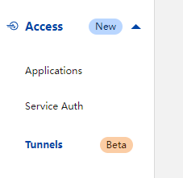
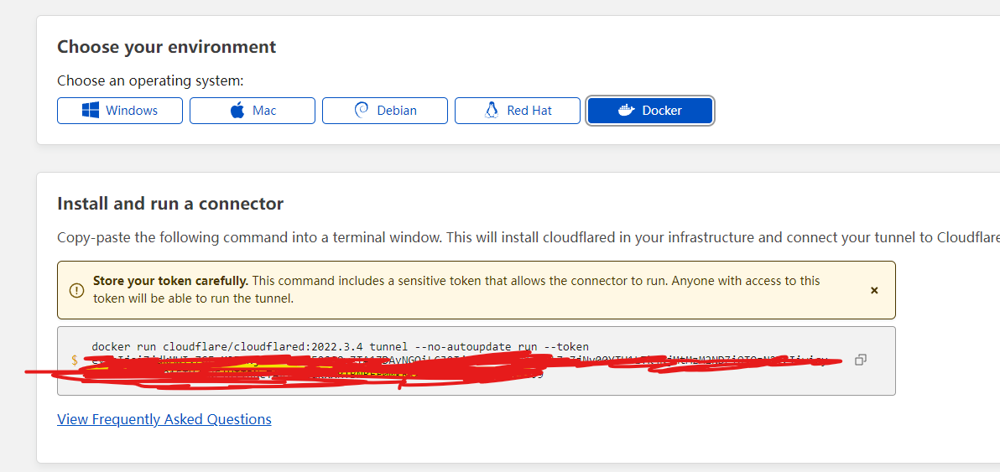
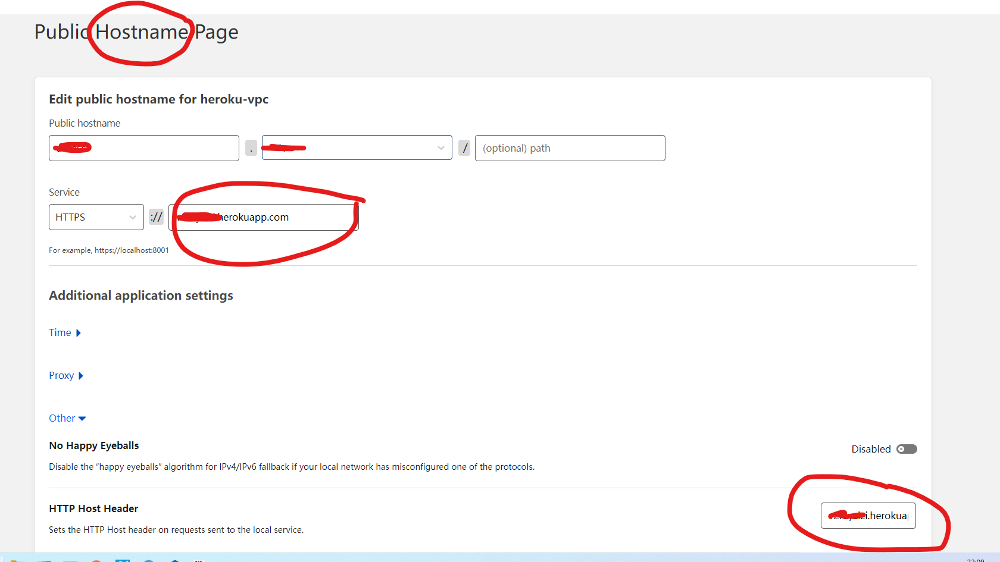
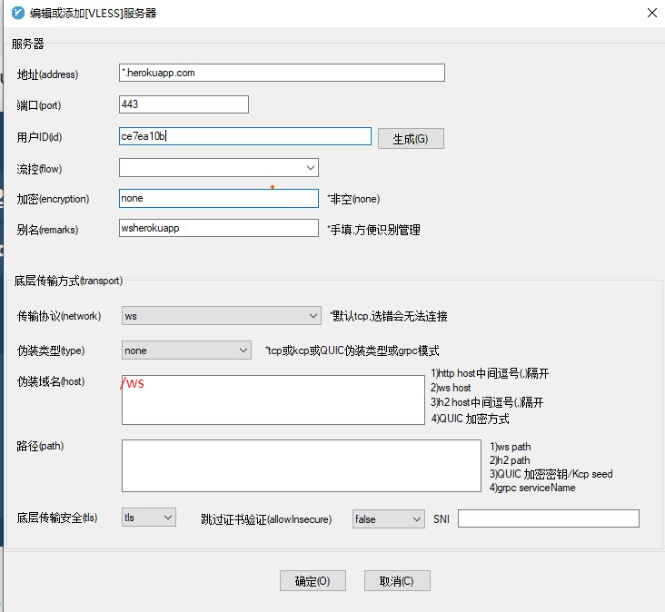

# Cloudflare Tunnel

## 申请 Cloudflare, 并且开通 https://dash.teams.cloudflare.com/

虽然免费，但是申请 zero trust 需要绑定信用卡。

> 用人反馈不需要绑定信用卡，但是我是需要的。

需要一个**域名**，并且绑定到 Cloudflare。

## Cloudflare tunnels

## 保存 Token

在创建时候，可以在 Tunnels 的页面中找到 Token。

> Token 是 `--token` 后面的字符串。就是图片中，用**红色涂抹**的部分。

## 添加域名

**注意事项**，

1. 定义一个自己的二级域名，不要和其他的二级域名冲突。

> 这个域名就是你 tunnel 的地址，需要最后配置在 V2ray 客户端中。

2. Service 配成自己 heroku 的名字， \*\*\*.herokuapp.com

3. HTTP Host Header
   把自己 heroku 的名字， \*\*\*.herokuapp.com，添加进入，**很重要**。

然后把 Token 配置到 Github Action `HEROKU_TUNNEL_TOKEN`。然后重新部署 herokuapp。

Cloudflare Tunnel 的配置，运行在 herokuapp 的 Cloudflared 会动态获取。 也就是说，如果成功后，你在 Cloudflare Tunnel 的改动会动态同步到 herokuapp 中。

重新部署 herokuapp 成功后， 记得在浏览器输入你 tunnel 地址和 自己 herokuapp 的地址，如果返回 Bad Request 字样，代表一切通顺。tunnel 地址可能会有 1 分钟左右延迟。

> herokuapp 如果长时间不访问就会休眠。。所以你如果用tunnel，就需要一个定时job 访问herokuapp url.

## v2rayN

其他配置和直接连接 herokuapp 是**一样的**，只需要把 v2rayN 的配置**地址改成你自己 tunnel 的地址**就可以。也就是你在设置 tunnel，添加的自己的域名。

