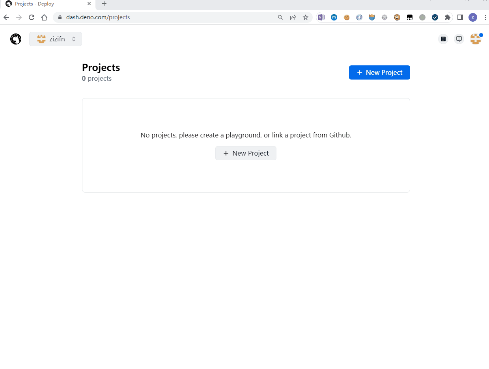
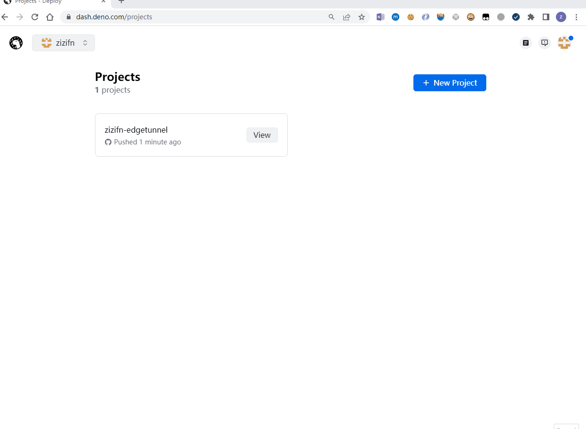

# Deno deploy Install

## Fork 本项目到自己 Github 下

**请定期按照 github 的提示，同步 code 到自己的项目**。

## 登录 Deno deploy

用 Github 账户登录 https://deno.com/deploy

> 相关免费策略，https://deno.com/deploy/pricing

## New Project

请在配置过程中 **记住 UUID**, 并且选择正确的部署入口文件。`apps\deno-bypass\src\bypass.ts`

如果 UUID 忘记 或者入口文件有变化，也可以在 deno 管理界面修改项目的配置。

其他更多配置，比如使用量，请自行探索。

## 项目地址

点击 View 项目会自动打开。
记住项目地址，并且**留意返回的网站内容**，是否有提供缺少关键配置。
