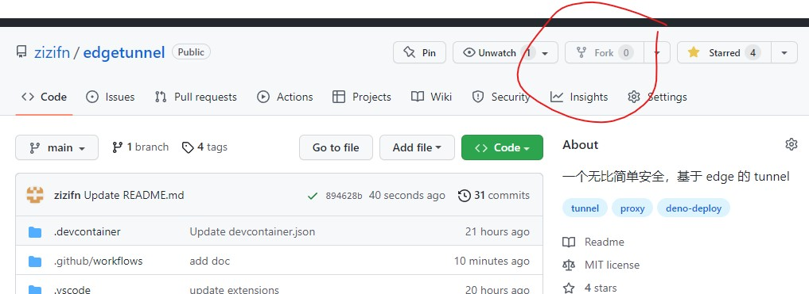
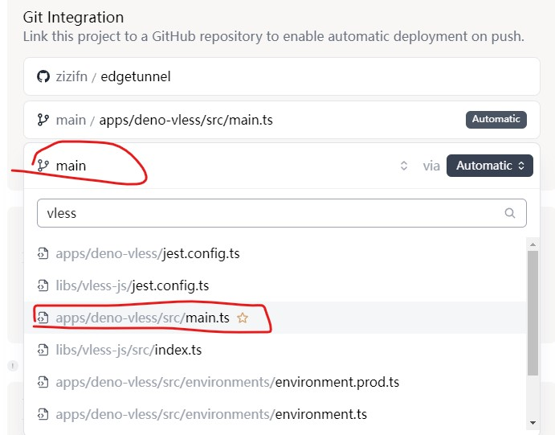
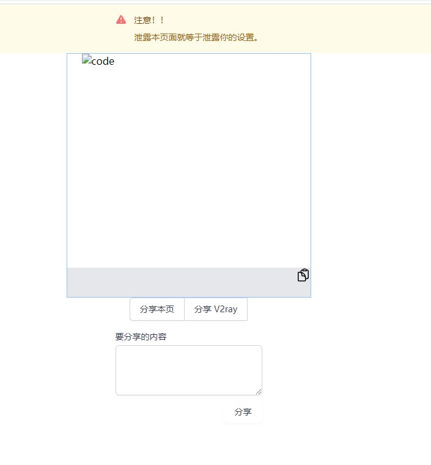

# Deno deploy Install

## 风险提示

`Deno deploy` 采用 [fair use policy](https://deno.com/deploy/docs/fair-use-policy), 翻译成中文就是`看良心使用`。 违反可能会封号。

## Fork 本项目到自己 Github 下

**请定期按照 github 的提示，同步 code 到自己的项目**。

## 登录 Deno deploy

用 Github 账户登录 https://deno.com/deploy

> 相关免费策略，https://deno.com/deploy/pricing

## New Project

请在配置过程中 **记住 UUID**, 并且选择正确的部署入口文件。`apps\deno-vless\src\main.ts`

### 流程演示

> GIF 仅仅是流程演示，具体入口文件，请看上图。

https://raw.githubusercontent.com/zizifn/edgetunnel/main/doc/deno-deploy.gif

如果 UUID 忘记 或者入口文件有变化，也可以在 deno 管理界面修改项目的配置。

https://raw.githubusercontent.com/zizifn/edgetunnel/main/doc/deno-deploy2.gif

其他更多配置，比如使用量，请自行探索。

## 项目地址

点击 View 项目会自动打开。一开始返回 `401`.

> 如果遇到 deno 生成域名不能访问的情况，请自己在 setting 里面绑定自己域名。
> 
> 只要 deno 网站可以访问，你生成的服务就应该可以访问。
> 
> 目前移动宽带貌似有这种问题。

不要慌张, 把你设置的 `UUID` 输入到弹出的用户名或者密码中。

然后会自动跳转到如下界面。

