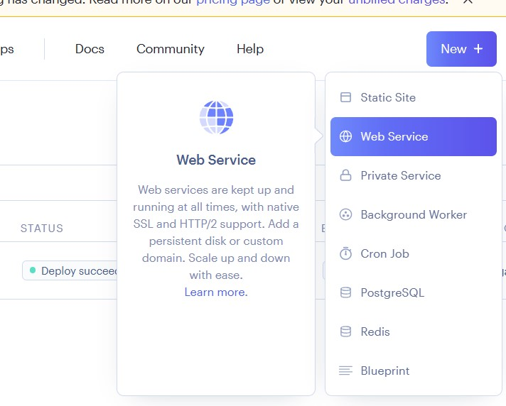
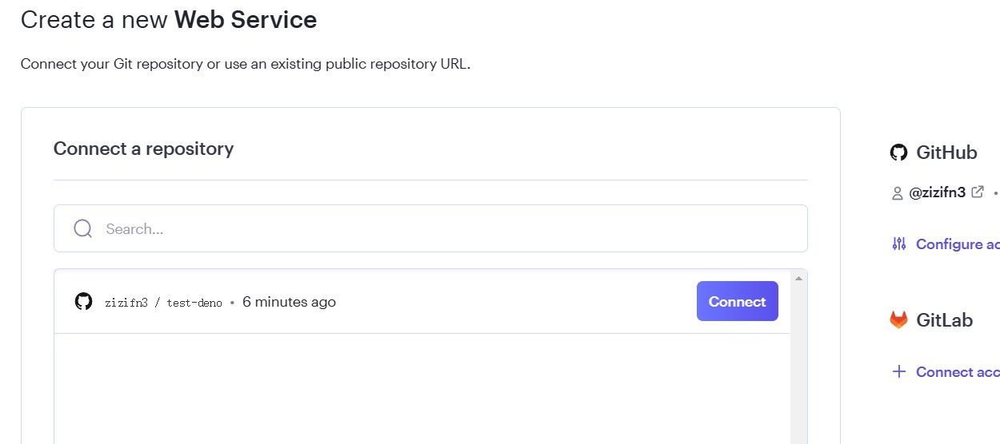
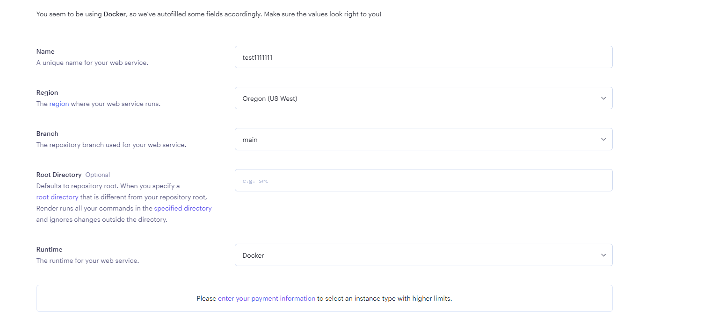
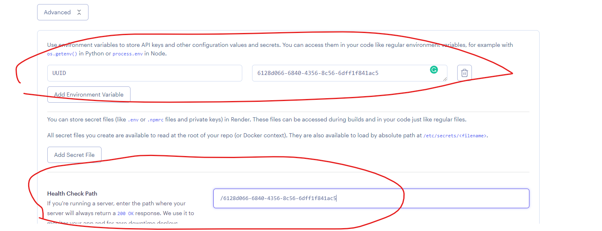

# Render

## 登录 render 账户

## Render Web APP 每月有 100GB 出站流量限制

如果使用 AWS ip 注册 Render 账户，会被要求绑定信用卡才能使用 Web APP。如果出现需要绑卡提示，建议更换 ip 注册。

https://render.com/

## 访问 https://dashboard.render.com/

## New Project

## 关联 github 账户

## 部署新项目

需要填写如下信息，具体请参考下图.

> Render 入口为 Cloudflare cdn，如果可以优选到亚洲地区 cloudflare ip，新加坡区速度最好。否则 cloudflare 默认美国线路，选美区速度最好。

**⚠️ 添加环境变量 UUID**

## 访问主页面

输入UUID，就可以访问服务。
