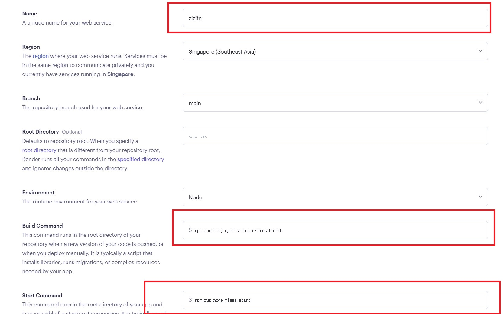
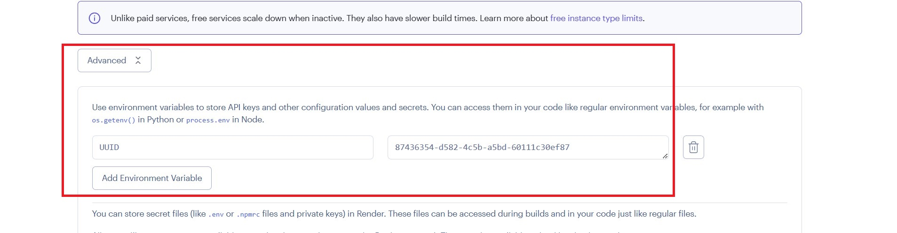

# Render

## 登录 render 账户

https://render.com/

## 访问 https://dashboard.render.com/

## New Project

## 关联 github 账户

## 部署新项目

需要填写如下信息，具体请参考下图.

| 选项          | 值                                      |
| ------------- | --------------------------------------- |
| Build Command | `npm install; npm run node-vless:build` |
| Start Command | `npm run node-vless:start`              |

**⚠️ 添加环境变量 UUID**

